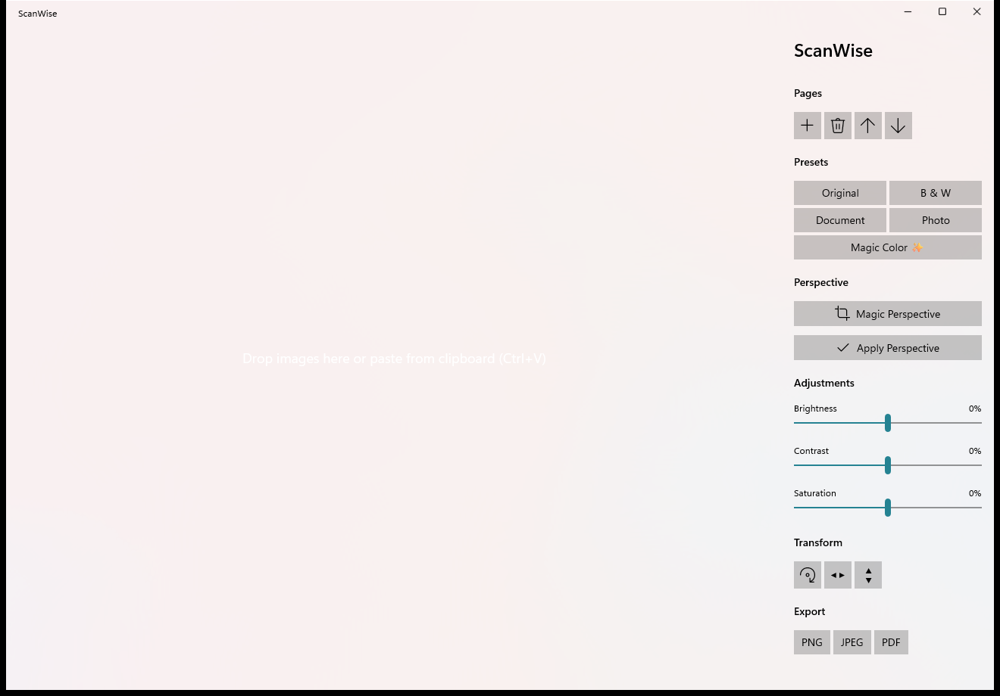

# ScanWise

[](https://github.com/rabie3150/ScanWise/actions/workflows/ci.yml)

A lightweight, open-source Windows document scanner built with C++20, WinUI 3, and OpenCV. Bring mobile scanning quality to the desktop with perspective correction, smart cropping, and document enhancement — entirely offline.

## Download

Get the latest installer or portable ZIP from the [Releases](https://github.com/rabie3150/ScanWise/releases/latest) page.



## Features

- **Drag & drop / clipboard import** — drop image files, or paste from the clipboard.
- **Magic Perspective** — automatic document edge detection with draggable corner handles for manual refinement.
- **Perspective flattening** — four-point homography transform to straighten angled shots.
- **Filter presets** — Original, Black & White, Document, Magic Color ✨, and Photo.
- **Manual adjustments** — brightness, contrast, and saturation sliders.
- **Multi-page support** — add, remove, and reorder pages in the sidebar.
- **Export** — single-page PNG / JPEG, or multi-page PDF.

## Requirements

- Windows 10/11 x64
- Visual Studio 2022 (Community, Professional, Enterprise, or Build Tools) with the **Desktop development with C++** workload
- CMake 3.28+
- Ninja
- PowerShell

## Quick Build

> **Note:** The first build compiles OpenCV from source, which can take 15–30 minutes depending on your machine.

Open a PowerShell window and run:

```powershell
# 1. Clone dependency sources (one-time)
git clone --branch 4.11.0 --depth 1 https://github.com/opencv/opencv.git deps/opencv
git clone --branch v2.4.4 --depth 1 https://github.com/libharu/libharu.git deps/libharu

# 2. Fetch WinUI 3 NuGet packages (one-time)
#    Download nuget.exe from https://dist.nuget.org/ into deps/nuget.exe, then:
deps/nuget.exe install Microsoft.WindowsAppSDK -Version 1.6.250602001 -OutputDirectory deps/nuget
deps/nuget.exe install Microsoft.Windows.CppWinRT -Version 3.0.260520.1 -OutputDirectory deps/nuget
deps/nuget.exe install Microsoft.Web.WebView2 -Version 1.0.2651.64 -OutputDirectory deps/nuget

# 3. Configure & build
.\configure_release.ps1
.\build_release.ps1
```

Output binaries:

```
out\build\release\bin\ScanWise.exe
out\build\release\bin\scanwise_engine_tests.exe
```

## First run

ScanWise is an unpackaged WinUI 3 app, so the Windows App SDK runtime must be installed once per machine. Run as Administrator:

```powershell
.\out\build\release\bin\install_runtime.ps1
```

After that, launch the app:

```powershell
.\out\build\release\bin\ScanWise.exe
```

You can also open an image directly on startup:

```powershell
.\out\build\release\bin\ScanWise.exe "C:\path\to\image.jpg"
```

## Run tests

```powershell
.\out\build\release\bin\scanwise_engine_tests.exe
```

## Project layout

- `engine/` — OS-agnostic image processing core (OpenCV static).
- `app/winui/` — Windows UI shell (WinUI 3 / C++/WinRT).
- `deps/` — OpenCV, libharu, and WinUI 3 NuGet packages (fetched at build time, not committed).
- `tools/` — Developer utilities, packaging scripts, and UI automation helpers.
- `assets/` — App icons and store assets.

## Releases

Pre-built installers and portable packages are published automatically on the [Releases](https://github.com/rabie3150/ScanWise/releases) page when a version tag (`v*.*.*`) is pushed.

| Asset | Description |
|-------|-------------|
| `ScanWise_Setup.exe` | Windows installer with Start Menu shortcuts |
| `ScanWise_Portable.zip` | Portable version, no installation needed |

Run the installer as Administrator if you need to install the Windows App SDK runtime.

To build the installer locally:

```powershell
.\tools\build_installer.ps1
```

To build the portable package locally:

```powershell
.\tools\package_portable.ps1
```

## Contributing

See [CONTRIBUTING.md](CONTRIBUTING.md).

## License

[MIT](LICENSE)
